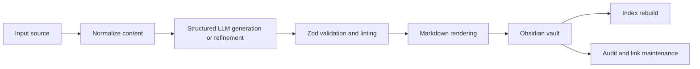
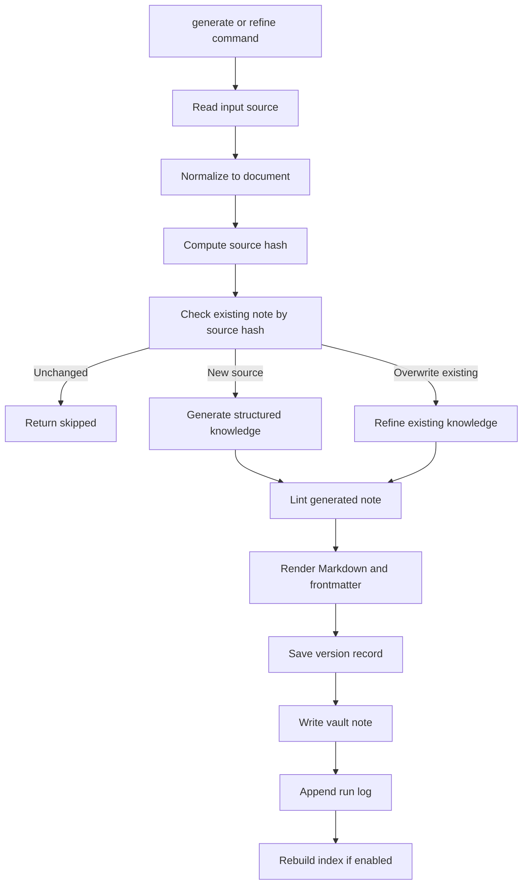
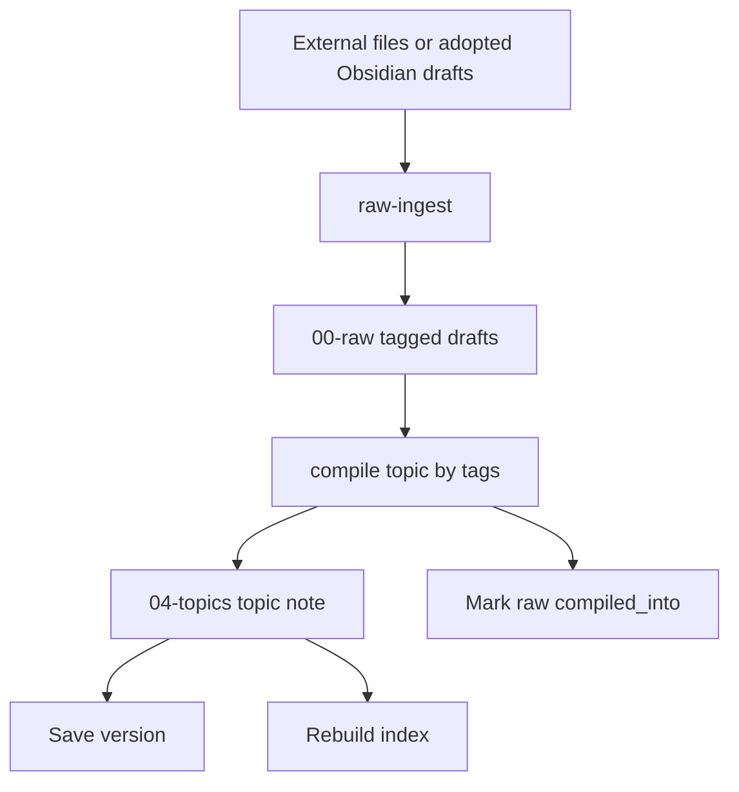

# Architecture

Knowledge Compiler is a local-first CLI application. It accepts text-like sources, normalizes them into plain content, asks an OpenAI-compatible LLM for schema-constrained knowledge objects, renders those objects as Markdown, and writes them into an Obsidian-compatible vault.

## System Flow

## Main Layers

### CLI Layer

`cli/generate-note.ts` is the main command router. It defines subcommands for generating notes, refining notes, raw ingestion, topic compilation, indexing, auditing, linking, vault linting, and version diffs.

`cli/ingest.ts` is a separate bulk ingest command for processing a directory of `.txt`, `.md`, and `.pdf` files concurrently through the generate pipeline.

### Configuration Layer

`config/config.ts` validates environment variables at process startup. The exported `config` object groups settings for OpenAI, the vault, logging, cache, prompt versioning, chunking, audit behavior, topic compilation, index generation, and Obsidian link style.

### Normalization Layer

`pipelines/normalize.pipeline.ts` converts supported input types into a `NormalizedDocument`:

- `raw_text` becomes `text`.
- `url` becomes `article` through Readability extraction.
- `pdf` becomes `paper` through `unpdf`.
- `youtube` becomes `video` through transcript extraction.
- `github_repo` becomes `repo` by fetching repository README and metadata.
- `rss` becomes `feed` by parsing feed entries.

### LLM Layer

`llm/llm.client.ts` wraps OpenAI chat completions with Zod response formatting. Every structured call includes:

- a schema name,
- system and user prompts,
- model and temperature,
- prompt version,
- optional cache lookup,
- token usage and estimated cost.

### Pipeline Layer

The pipeline layer coordinates content transformation and vault side effects:

- `pipelines/orchestrator.ts` handles single-source generate/refine workflows.
- `pipelines/raw.pipeline.ts` writes deterministic raw drafts without LLM calls.
- `pipelines/topic.pipeline.ts` synthesizes tagged raw drafts into topic notes.
- `pipelines/markdown.transform.ts` renders validated knowledge objects as Obsidian-friendly Markdown.
- `pipelines/link.pipeline.ts` resolves wikilinks and maintains backlinks.
- `pipelines/index.pipeline.ts` rebuilds the vault root `index.md`.
- `pipelines/audit.pipeline.ts` produces health reports and optional deterministic fixes.
- `pipelines/versions.pipeline.ts` saves and compares structured version records.

### Schema Layer

Schemas in `schemas/` define the contracts between the LLM, Markdown renderer, and vault scanners. The primary generated object is `Knowledge`, made of title, tags, summary, key concepts, deep-dive sections, related links, and open questions.

### Vault Layer

The vault is the durable output surface. Paths are centralized in `utils/path-resolver.ts` and include raw drafts, generated notes, topic notes, index, audit reports, version records, and run logs.

## Generate Flow

Long inputs are chunked before generation. The first chunk creates the initial knowledge object, and each later chunk refines that object with a structured diff.

## Raw-To-Topic Flow

This workflow is designed for an LLM wiki loop: collect raw material first, then synthesize a stable topic note from multiple tagged drafts.

## Design Constraints

- Markdown files are the source of truth.
- Zod validates structured LLM output and frontmatter.
- Vault paths should not be hardcoded outside `utils/path-resolver.ts`.
- LLM calls should return structured objects, not freeform Markdown.
- Deterministic commands such as raw ingestion, indexing, link maintenance, and parts of audit should not require an LLM.
